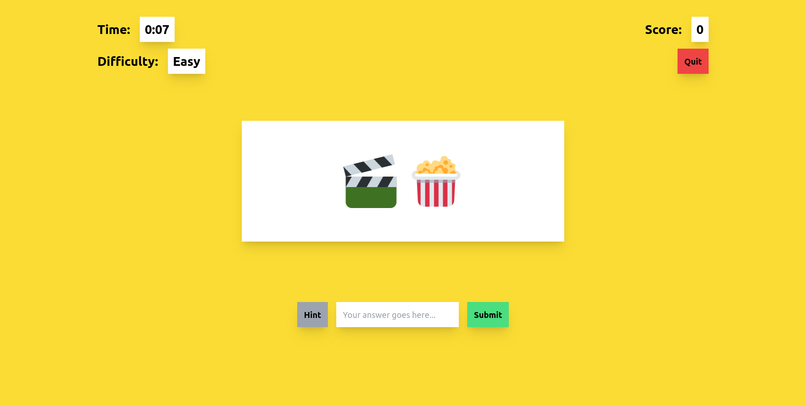

# Emoji Riddle 🎉

Welcome to **Emoji Riddle** – a fun and interactive web app where you guess the word, phrase, or title based on emojis! 🧩

## Overview

Emoji Riddle is designed to challenge your emoji decoding skills. Each riddle presents a series of emojis that represent a common word, phrase, or title. Your goal is to guess the correct answer and see how many you can solve! 🌟

## Status

🚧 **Emoji Riddle is currently in development.** I am working hard to build an exciting and engaging experience for all players. Stay tuned for updates!

## Features (Planned)

- 🧠 **Challenging Riddles:** Decode emojis to solve fun and tricky puzzles.
- 🏆 **Leaderboard:** Compete with friends and others to top the leaderboard.
- 🎮 **Easy to Play:** Simple and intuitive gameplay suitable for all ages.

## Contributing

I appreciate your interest in contributing! At this stage, I am focused on development, but feel free to share your ideas or feedback. I'll provide more details on contributing once the project is further along.

## Contact

If you have any questions or feedback, feel free to reach out! I'd love to hear from you.

---

Thanks for checking out **Emoji Riddle**! Keep an eye out for updates, and get ready to test your emoji skills soon! 🎉
